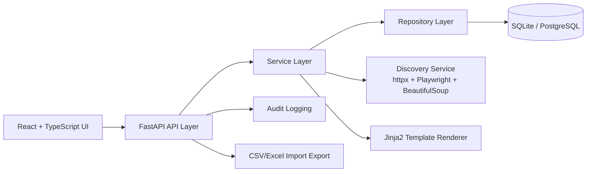

# Architecture

## Layers
1. **API Layer**: endpoint routing, validation, DI.
2. **Service Layer**: business logic (discovery, drafting, review, dashboard, import/export).
3. **Repository Layer**: DB queries via SQLAlchemy repositories.
4. **Persistence Layer**: SQLAlchemy models + Alembic migrations.

## Cross-Cutting Concerns
- Structured JSON logging
- Environment-based configuration
- Centralized exception handling
- Type hints throughout
